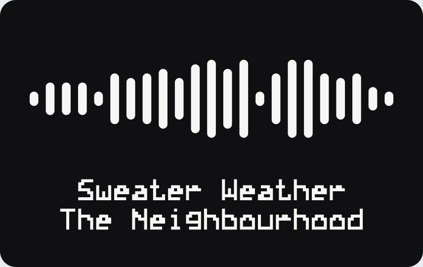

[](https://github.com/noluyorAbi/soundtag/actions/workflows/ci.yml)
[](https://www.npmjs.com/package/soundtag)
[](LICENSE)

Turn a song link into a printable keychain tag. You get a 3MF with the filament change already assigned, a binary STL, and an SVG with separate cut and engrave layers for a laser. No upload, no account, no environment variables.

Not affiliated with, endorsed by, or sponsored by Spotify AB. Spotify is a trademark of Spotify AB. Read [TRADEMARKS.md](TRADEMARKS.md) before you sell anything.

## The one thing this does differently

Every generator in this corner of the internet produces a mesh. The awkward part is what happens next: two colours in the same layer means a tool change on every layer of the code, and a single extruder printer cannot do it at all.

So the object is built around the change instead of around the picture. The plate stops at a height, and the code starts exactly there. Nothing belonging to the body exists above that line, nothing belonging to the code exists below it, and `buildTag` throws if that ever stops being true. One change, one pause, one swap.

```
z 3.0  ┌──────────────────────────────┐  filament 2, the code
z 2.4  ├──────────────────────────────┤  <- the only change, layer 13 at 0.2 mm
z 0.0  └──────────────────────────────┘  filament 1, the plate
```

## Try it

```bash
npx soundtag "https://open.spotify.com/track/2QjOHCTQ1Jl3zawyYOpxh6"
```

```
  ./2qjohctq1jl3zawyyopxh6.3mf
  ./2qjohctq1jl3zawyyopxh6.svg
75.6 by 16.2 by 3 mm, bar
  Insert the filament change at layer 13, which starts at z 2.4 mm.
  material 2.96 cm3, about 3.7 g of PLA
  contrast 17.6 to 1, which is good
  the Spotify mark is not extruded. --mark adds it, see TRADEMARKS.md first.
```

Or use the site, which does the same thing with a drawing next to it.

## Shapes

| Shape | Size | What it is for |
|---|---|---|
| `bar` | 75.6 by 16.2 mm | The keyring tag. Sits flat against a key |
| `coin` | 50 mm | Round, hole at twelve o'clock |
| `card` | 85.6 by 54 mm | Wallet sized, two lines of text under the code |
| `ornament` | 70 mm | Hangs on a tree or a mirror |
| `magnet` | 75.6 by 16.2 mm | Two 6 by 2 mm magnet seats in the back, no keyring hole |

 

Adding text grows the tag rather than shrinking the code, because the code is the point of the object.


## Command line

```
soundtag <spotify link> [options]     build one tag
soundtag batch <link> <link> ...      pack several tags onto one plate
soundtag shapes                       list the shapes
soundtag palette                      list filament pairs by contrast
```

| Option | Why you would use it |
|---|---|
| `--shape <name>` | bar, coin, card, ornament, magnet |
| `--width <mm>` | The long side. Everything else scales with it |
| `--thickness <mm>` `--relief <mm>` | Total thickness, and how far the code stands out |
| `--title` `--artist` | Raised text, in the code's filament |
| `--layer-height <mm>` | Only used to work out which layer the change lands on |
| `--mark` | Extrude Spotify's logo too. Read TRADEMARKS.md first |
| `--bed <name>` | bambu-a1, bambu-a1-mini, bambu-p1, bambu-x1, prusa-mk4, generic-220 |
| `--format <list>` | 3mf, stl, svg, preview |
| `--from-svg <file>` | Use a saved code image and make no network call at all |

A whole playlist becomes one plate:

```bash
soundtag batch link1 link2 link3 --bed bambu-a1 --out ./plate
```

The packer sorts by height, fills rows, and tells you what did not fit rather than silently dropping it. Every tag on the plate shares the same change height, so a plate of twelve is still one filament change.

## As a library

```ts
import { parseScannable, buildTag, threeMf, singleTagPlacement } from "soundtag";

const scannable = parseScannable(await (await fetch(url)).text());
const tag = buildTag(scannable, { shape: "bar", title: "Sweater Weather" });

console.log(tag.change);            // { z: 2.4, layer: 13, exact: true }
const bytes = threeMf([singleTagPlacement(tag)]);
```

`buildTag` returns the parts, the meshes, the volumes per filament and the change plan. Nothing in the library touches the filesystem or the network.

## Printing it

| Setting | Value | Why |
|---|---|---|
| Layer height | 0.2 mm | The default relief of 0.6 mm is exactly three layers |
| Filament change | layer 13 | Printed by the slicer as the first layer of the code |
| Supports | none | There is nothing overhanging |
| Brim | none | The footprint is 12 cm2 of flat plate |
| Infill | 15 percent or more | It is 3 mm thick; this is not a structural part |

With an AMS or an MMU, the 3MF arrives with the parts assigned and there is nothing to set. With one extruder, slice it in one colour and insert a colour change at layer 13. The result is identical.

Contrast is what a camera reads, not colour. `soundtag palette` ranks the pairs; anything under 3 to 1 is refused in the UI with the reason.

## What is verified, and what is not

Claims in this README are one of two kinds, and they are labelled.

**Checked on every build**, by the test suite: the mesh is closed, its normals point out, the volume matches the polygon area times the height, the archive's checksums match a second ZIP reader, two builds of the same tag are byte identical, and no part of the body reaches above the change height.

**Checked by a slicer**: every shape opens in Bambu Studio as `manifold = yes` with `edges_fixed="0" degenerate_facets="0" facets_reversed="0"`, and a round trip through its CLI keeps both part names and both filament ids. The commands and their output are in [VERIFY-LOG.md](VERIFY-LOG.md).

**Not verified yet**: whether a printed tag scans, at what size, and with which filament pairs. That depends on a camera, a light and two plastics, and this project will not claim it before it has measured it. The log is where the answer will go, with the phone and the version it was measured on. If you print one, [tell us what happened](../../issues/new?template=scan-problem.md).

## Refused, on purpose

Documented decisions, so they are not rediscovered as bugs.

**Engraved text on the back.** Built, measured, removed. A letter's counter has to stay standing inside the recess, and the bridges a triangulator adds to reach it land on the outline. Bambu Studio reported 234 non manifold edges. Text is raised on the front instead.

**Stacked slabs for the magnet seats.** Same failure, one shared face. The body is one solid with real pockets now.

**Album art.** Cover art is licensed from labels, the design guidelines forbid modifying it, and physical products are exactly the excluded use. This will not be built.

**The Spotify mark, by default.** Extruding a logo adds depth to it, which the design guidelines forbid. `--mark` exists, it is off, and the flag's help text says why.

## How it is built

Five runtime dependencies: `next`, `react`, `react-dom`, `server-only`. No geometry library, no ZIP library, no 3MF library, no CSS framework. The ear clipper, the ZIP writer, the 3MF writer, the STL writer, the SVG path reader and the 5 by 7 font are all in `src/lib`, each with the reason it is there written at the top of the file.

```
src/lib/scannable.ts      reads Spotify's code image, strictly
src/lib/tag.ts            composes the 2D geometry and builds the parts
src/lib/geom/             polygons, ear clipping, extrusion, meshes
src/lib/layouts.ts        the five shapes, and nothing else about them
src/lib/export/           3mf, stl, svg, zip
src/lib/filament.ts       contrast, and which layer the change lands on
src/cli/main.ts           the command line tool
src/app/                  the site
```

The site composes previews in the browser from one fetched code, so moving a slider costs no server time, and the download route rebuilds the same tag from the same functions.

## Develop

```bash
npm install
npm run dev
npm run typecheck && npm run lint && npm run lint:prose && npm test
```

`npm run verify:print` slices a generated 3MF with Bambu Studio's CLI and checks what came out. It skips with a message when the slicer is not installed, so it never fails a machine that cannot run it.

## Licence

MIT for the software. The Spotify Code inside the output belongs to Spotify, and this project does not and cannot grant you rights to it. Make a tag for yourself or for a friend. Selling printed tags is between you and Spotify. See [TRADEMARKS.md](TRADEMARKS.md).
